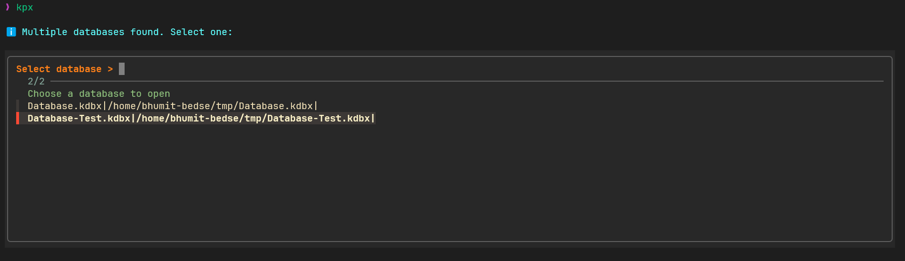
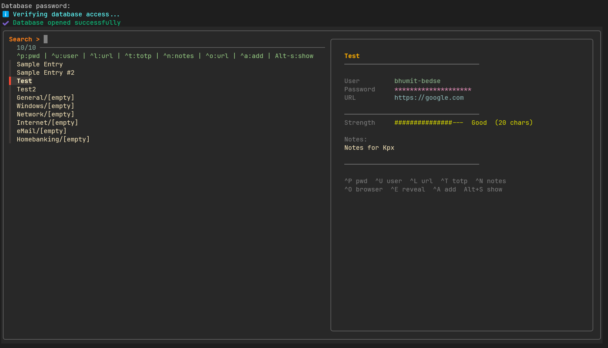

# kpx

> Enhanced interactive terminal interface for KeePassXC databases using `keepassxc-cli` and `fzf`.

A fork of [creusvictor/kpx](https://github.com/creusvictor/keepassxc-fzf) with significant enhancements — themes, multi-database support, in-terminal notifications, new entry creation, TOTP, and more.

---

## Preview

### Database Selection


### Main Interface


---

## Features

- **Fuzzy search** across all entries with live preview
- **6 built-in themes** — tokyo-night, gruvbox, catppuccin, dracula, nord, minimal
- **Multi-database support** — list databases in config, pick with fzf on launch
- **In-terminal notifications** — floating popup on copy, themed to match your colorscheme
- **New entry creation** — `Ctrl+A` interactive form with password generator
- **TOTP support** — copy live 2FA codes with `Ctrl+T`
- **Open URL** in browser with `Ctrl+O` (WSL-aware)
- **Full entry reveal** in pager with `Ctrl+E`
- **Password strength meter** in preview and popup
- **Config file** — persistent settings at `~/.config/kpx/config`
- **WSL support** — uses `clip.exe` for clipboard on Windows Subsystem for Linux
- **Secure** — password stored in `chmod 600` temp file, never in environment

---

## Requirements

### Required
- [`keepassxc-cli`](https://keepassxc.org/) — KeePassXC command-line client
- [`fzf`](https://github.com/junegunn/fzf) — fuzzy finder

### Clipboard (one of)
- `xclip` — X11
- `wl-copy` — Wayland
- `pbcopy` — macOS
- `clip.exe` — WSL / Windows

---

## Installation

### Quick install (recommended)

```bash
curl -fsSL https://raw.githubusercontent.com/YOUR_USERNAME/kpx/main/install.sh | bash
```

### Install to system (requires sudo)

```bash
curl -fsSL https://raw.githubusercontent.com/YOUR_USERNAME/kpx/main/install.sh | sudo bash
```

### Manual install

```bash
git clone https://github.com/YOUR_USERNAME/kpx.git
cd kpx
make install              # installs to ~/.local/bin
sudo make install-system  # installs to /usr/local/bin
```

### Install dependencies

```bash
# Ubuntu / Debian
sudo apt install keepassxc fzf xclip

# Arch Linux
sudo pacman -S keepassxc fzf xclip

# Fedora
sudo dnf install keepassxc fzf xclip

# macOS
brew install keepassxc fzf
```

### Uninstall

```bash
make uninstall
# or
sudo make uninstall-system
```

---

## Usage

```bash
kpx [OPTIONS] [database.kdbx]
```

### Options

| Option | Description |
|--------|-------------|
| `-h, --help` | Show help |
| `-k, --keyfile FILE` | Use keyfile |
| `-v, --version` | Show version |
| `--theme THEME` | Override theme for this session |
| `--init` | Create default config file |
| `--list-themes` | List available themes |

### Environment Variables

| Variable | Description |
|----------|-------------|
| `KPDB` | Path to KeePass database |
| `KPKF` | Path to keyfile |

### Examples

```bash
# Basic usage
kpx ~/passwords.kdbx

# With keyfile
kpx -k ~/key.key ~/passwords.kdbx

# Use a specific theme
kpx --theme dracula ~/passwords.kdbx

# Using environment variables
export KPDB="$HOME/passwords.kdbx"
kpx

# No arguments — picks database from config
kpx
```

---

## Keybindings

| Key | Action |
|-----|--------|
| `Enter` | Copy password + exit |
| `Ctrl+P` | Copy password (clears in 10s) |
| `Ctrl+U` | Copy username (clears in 30s) |
| `Ctrl+L` | Copy URL (clears in 30s) |
| `Ctrl+N` | Copy notes (clears in 30s) |
| `Ctrl+T` | Copy TOTP code (clears in 10s) |
| `Ctrl+O` | Open URL in browser |
| `Ctrl+E` | Show full entry in pager |
| `Ctrl+A` | Add new entry |
| `Alt+S` | Show/hide password in preview |
| `Alt+H` | Password strength popup |
| `ESC` | Exit |

Standard fzf navigation: `↑↓`, `Ctrl+J/K`, type to filter.

---

## Configuration

Run `kpx --init` to create the default config at `~/.config/kpx/config`.

```ini
# kpx configuration

# Theme: tokyo-night | gruvbox | catppuccin | dracula | nord | minimal
theme = tokyo-night

# Clipboard clear timeouts (seconds)
pass_timeout  = 10
other_timeout = 30

# Default group for new entries
default_group = General

# Databases (add one per line, optional keyfile on next line)
database = /home/user/passwords.kdbx
# keyfile = /home/user/passwords.key

database = /home/user/work.kdbx
```

When multiple databases are configured, a fzf picker appears on launch to select which one to open.

---

## Themes

| Theme | Description |
|-------|-------------|
| `tokyo-night` | Dark blue/purple — default |
| `gruvbox` | Warm retro earth tones |
| `catppuccin` | Pastel dark |
| `dracula` | Purple/pink dark |
| `nord` | Arctic cool blues |
| `minimal` | Pure black and white |

```bash
kpx --theme gruvbox
```

Or set permanently in `~/.config/kpx/config`:
```ini
theme = gruvbox
```

---

## Security

- Master password is **always entered interactively** — never read from environment
- Password stored in a `chmod 600` temporary file for fzf subprocesses — not visible in `/proc/<pid>/environ`
- Temporary file deleted on exit via `trap`
- Clipboard auto-clears after configurable timeout (default 10s for passwords)
- Password masked with `*` characters in preview (length-accurate)

---

## WSL Support

On Windows Subsystem for Linux:
- Clipboard uses `clip.exe` (native Windows clipboard)
- URLs open with `explorer.exe`
- In-terminal notifications use `tput` cursor positioning (no Windows toast needed)

---

## Credits

Based on the original [kpx](https://github.com/creusvictor/keepassxc-fzf) by [@creusvictor](https://github.com/creusvictor).

---

## License

MIT
